# Pizza Sales Analysis Report_Power BI

Welcome to my Pizza Sales Analysis project, that show case my data analysis skills using MySQL and Power BI. This project uncover insights and trends that can help in making informed business decisions for boosting business revenue. 

## Description
Following steps have been taken to complete the project:

1.	Data Import and Cleaning
2.	Exploratory Data Analysis
3.	Date Related Columns
4.	DAX Measures

## 1.	 Data Import 
Imported the sales data into Excel, ensured it is clean, and structured for analysis.
                                    https://mavenanalytics.io/data-playground?page=6&pageSize=5

 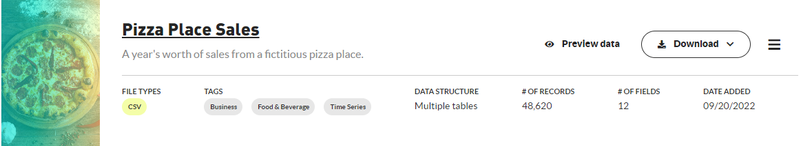

                                                             
After downloading data set from the above link, I wrote queries in MySQL workbench and obtained the results, which I could later match with my Excel visualizations to authenticate the results.
                                  
##   How to connect MYSQL database to Power BI:
First, go to more options of ‘Get Data’. Click on ‘MySQL database’ and press connect tab.
Provide server name as hostname: port number, then in database tab write the name of desired database to be imported, and press OK.

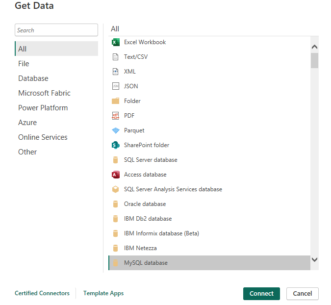

                             
Now click on database option and enter username and password in the blank fields in my case username was root. Click ok
Now the database would start loading in power bi.
Click on all the tables and press transform button.
It will load the data, which we can transform in power query

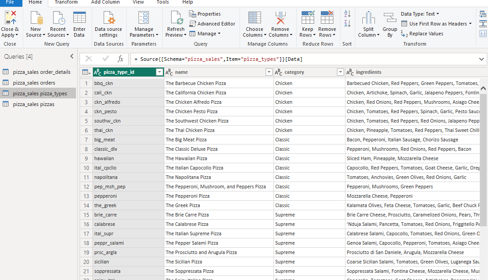

 

## 2.	 Data Cleaning:
After loading the data for editing in Power Query, I Checked for duplicates and if found removed duplicate records, missing values, or inconsistencies in the data. 

Checked for data types of columns and the header names of each table. I applied ‘use first row as header’ option on tables where I found inconsistencies. After applying initial changes to dataset, I clicked on 'Close and Apply' tab to load the data.

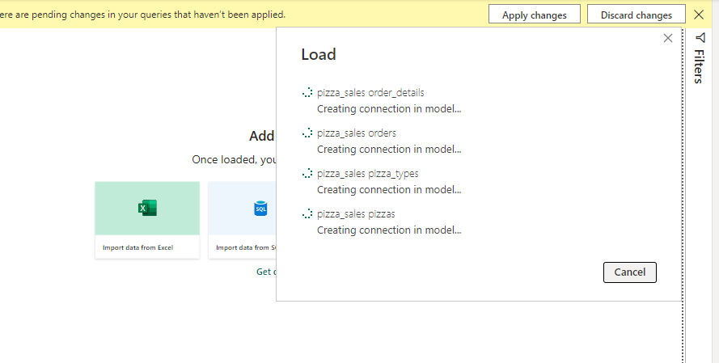

 

## 3.	Data Modeling:
 
After loading data, built relationships between tables showing cardinality one to many amongst tables.

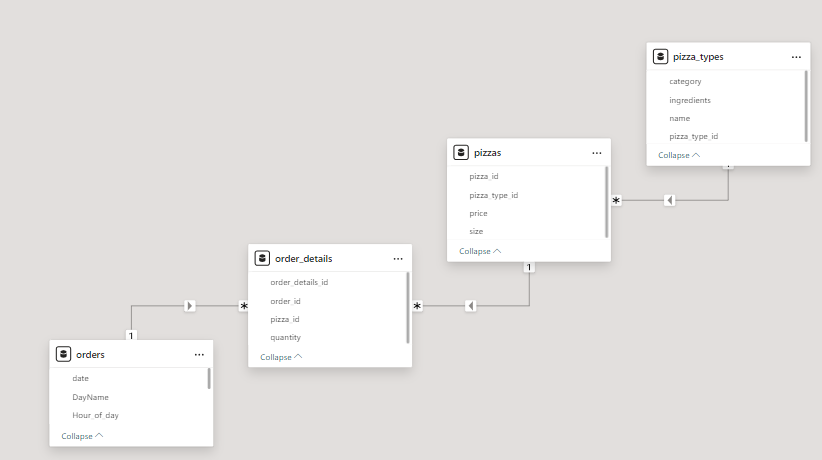

## 4.	Exploratory Data Analysis EDA:

## Initial Statistics:

Calculated key performance metrics such as total sales revenue, total orders, and total pizzas sold, average pizzas per order and average order value.

## Distribution Analysis:
Examined the distribution of pizzas quantity sold by category, orders and sizes to determine purchase patterns.	

## Trend analysis:
Investigated Sales trends over different periods i.e. hourly, monthly, and quarterly to identify peak hours and periods across different seasons.

## Categorical Analysis:
Analyzed the Percentage contribution of each pizza category to total revenue to identify bestselling pizza category.
Analyzed the percentage contribution of different pizza sizes to total revenue in order to understand customer preferences.

## 5.	Date Related Columns:

Day Name: To apply in slicer filteration and for detailed view of sales on daily basis.

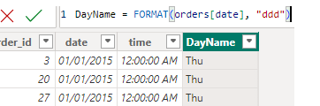
 
Month Name: To analyze monthly trends for orders.
 
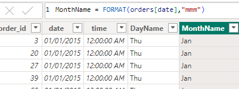

Hour: To find out peak hours of the day

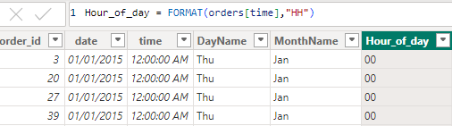 

Quarter: To examine seasonal variation of orders.
 
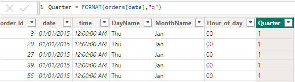

## 6.	DAX Measures:

I created a separate table for keeping all DAX measures within this tables named as ‘Key Measures’ so that the DAX measures are easily accessible.
 
 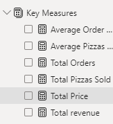
 
 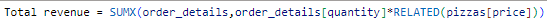

 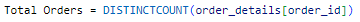
 
 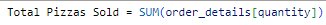

 

 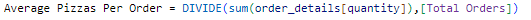

 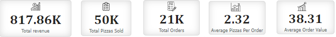

## Visualizations:
Pie Chart:	For viewing percentage contribution of Pizza sizes and categories to total revenue.

 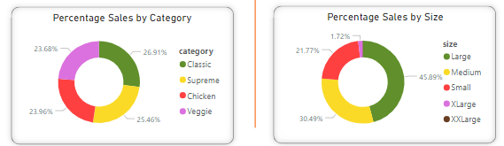
 
Area Chart:	For understanding the hourly, monthly and quarterly sales trends.

 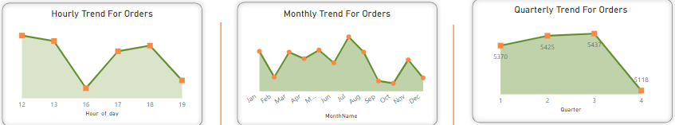
 
Clustered Bar Chart: 	To identify top selling pizzas with respect to size, orders, quantity sold and revenue. Also helped in analyzing least revenue generating pizzas.

 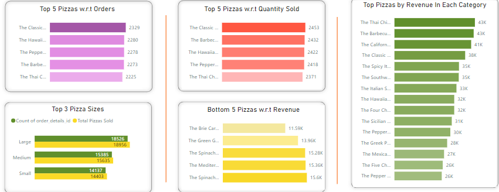

##          Tools and Technologies:

MySQL: Used MySQL workbench to apply database queries.

Power BI:  Utilized for data exploration, basic analysis, and visualizations.

## Files Included:

‘Pizza_Sales_Dashboard.pbix’:  [Download the Pizza Sales Dashboard](Pizza_Sales_Dashboard.pbix) Power BI file containing details on EDA, data transformations, and visualizations.

‘Pizza Sales Analysis Report.pptx’: [Pizza Sales Analysis Report](https://github.com/SanaMubarak01/Pizza_Sales_Analysis_PowerBI/blob/master/Pizza%20Sales%20Analysis%20Report.pptx)
 PowerPoint file to show summary of key findings and recommendations along with database queries, their results and visualizations.

‘Pizza_Sales_Dashboard.pdf’: [Download the Dashboard Preview in pdf](Pizza_Sales_Dashboard.pdf) Pdf file of dashboard for viewing final output.

## Open the Files:
Use Power BI to open `Pizza_Sales_Dashboard.pbix` for details on EDA and preliminary analysis.
		
Review the ` Pizza Sales Analysis Report.pptx ` in PowerPoint for a summary of database queries, their outcome along with insights and recommendations.

Open the file ‘Pizza_Sales_Dashboard.pdf’ to view the result in pdf format.
## Dashboard Preview:

